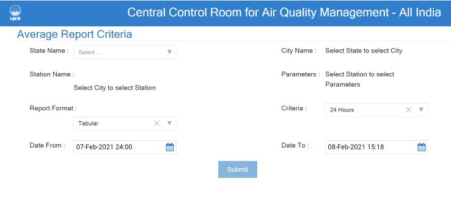
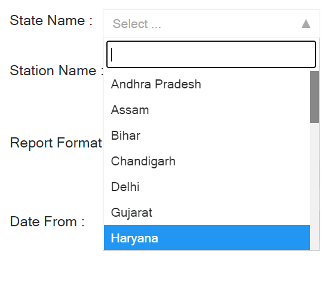
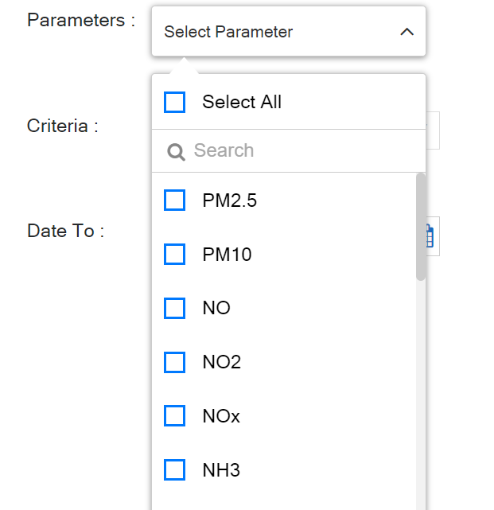
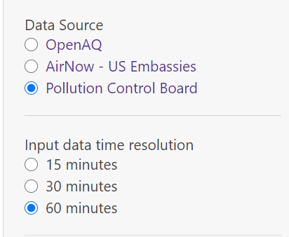
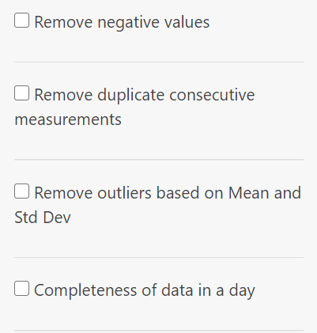
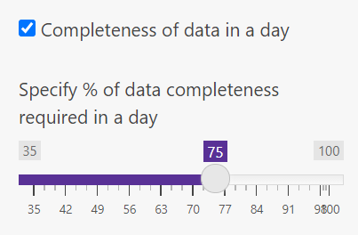
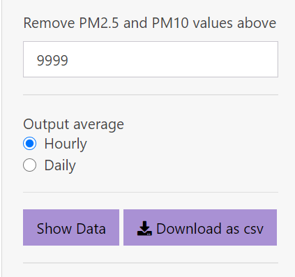

### We are in this together\!

A walk through to use this app for everyone -

How to Download Data from the CPCB website?

  - Example - Where do you live in India?

  - Find the nearest [CPCB
    station](https://app.cpcbccr.com/ccr/#/caaqm-dashboard-all/caaqm-landing)
    to download data from a regulatory air quality monitor.

  - Visit [CPCB
    website](https://app.cpcbccr.com/ccr/#/caaqm-dashboard-all/caaqm-landing)
    to access the Central/State Pollution Control Board Data.

  - Select the Indian state from the “State Name” dropdown.

  - Now select the city for which the data needs to be downloaded using
    the “City Name” dropdown menu.

  - Now from the “Station Name” dropdown select the desired station.

  - Select the Parameters. Note- Multiple parameters can be selected at
    a time.

  - Report Format- To use the PolluCheck app, Please keep the format as
    “tabular”.

  - Criteria- This dropdown will help you to select between different
    time averaging of data. Note- Pollucheck app only supports 15 min,
    30 min, and 60 min average data.

  - Now select the Start Date and End date of the data and click on
    “Submit”.
  - Download that data (15, 30, 60 min resolution would be good).
  - Select the source from where the data was downloaded.
  - Now select the time resolution at which the data was downloaded.

  - Select the check box according to your need.
    
      - Remove Negative values- This option helps you to remove all the
        negative values from your entire dataset.
    
      - Remove consecutive repeated measurements- This feature removes
        consecutive repetitive values in your dataset.
    
      - Remove Outliers based on Mean and Std Dev- Extreme data points
        are removed on the basis of the mean and SD of the data.
    
    
    
      - Completeness of data- You can select the desired level of
        completeness using the scroll bar.
    
    

  - Remove PM2.5 and PM10 values above- Usually, values above 999 are
    incorrect and can be removed using this filter option.

  - Average to- The uploaded data can be converted into daily or hourly
    mean values.

  - “Download the csv” or click on “show data” to see the data in the
    app.

  - Look at the time-series plot in Plots tab on what days it is high
    and at what time, look at the diurnal pattern and the general way on
    how air pollution varies.
  - Look at months which bother you.
  - Look for sources (which you think contribute to air pollution) and
    write back to us on what you see.
  - What more do you want to learn? Talk to the Humans of ILK.
  - You want to explore more or have an idea, contact us at
    [contact@ilklabs.com](contact@ilklabs.com).
  - If you have feature request - open an issue
    [here](https://github.com/adithirgis/OpenSourceAirQualityApp).
  - The major pollutants annual standards are plotted below.
